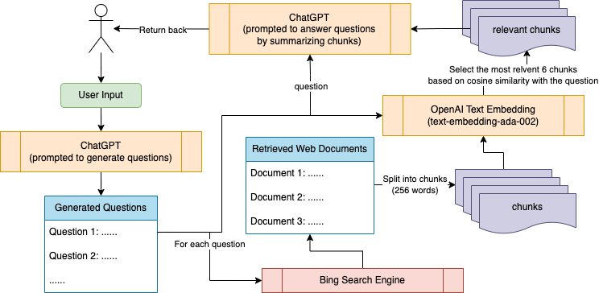

# ReadProbe
**An AI-powered tool to support lateral reading.**

The winning prototype in the
[2023 Canadian #AI Misinformation Hackathon](https://socialmedialab.ca/events/hackathon/).

A paper on this prototype is available on arXiv: http://arxiv.org/abs/2306.07875

## About

Lateral reading is a critical thinking approach used to evaluate the 
credibility and accuracy of information found online by stepping away 
from the initial source and exploring other sources to verify its 
authenticity. Lateral reading can reduce the risk of being misled by 
misinformation, propaganda, and other forms of disinformation. 
By cross-referencing information with multiple sources, users can become 
more informed and responsible consumers of information, promoting a better 
online community.

Live demo: https://readprobe.streamlit.app/. This web interface is to 
illustrate how this tool works and collect early feedback from users. 
For future work, **ReadProbe** could be embedded into a browser extension 
where users can directly select the text they want to probe into in the 
same tab without the hassle to copy and paste the text into a new tab.

## Overview

The figure below shows how **ReadProbe** works, especially the data flow
among different components.

<p align="center">
   
</p>

## Features

- **Question Generation**: To support lateral reading, we prompt OpenAI's 
[ChatGPT](https://openai.com/blog/chatgpt) to come up with **five**
questions that the user may ask when reading the input text.
- **Bing Search**: For each generated question, we call the
[Bing Web Search API](https://www.microsoft.com/en-us/bing/apis/bing-web-search-api)
to find relevant documents to answer the question. This module strengthens
ChatGPT's knowledge of events that happened after 2021 and mitigates its
known behavior to fabricate facts.
- **Relevance Ranking**: Web documents are usually long and only parts of
them are relevant to the question. Due to the input limit (4096 tokens) of
ChatGPT, we break the top **three** most relevant documents into text chunks 
(each with 256 words) and then select the most relevant **six** chunks to 
construct the input to the ChatGPT to generate the answer. To measure the
relevance, we use OpenAI's 
[text-embedding model](https://platform.openai.com/docs/guides/embeddings/what-are-embeddings)
to obtain semantic vectors for both the question and text chunks and then
select the top **six** most relevant chunks based on their cosine similarity
with the question.
- **Answer Generation**: With the question and relevant chunks from **Bing Search** 
module and **Relevance Ranking** module, we prompt ChatGPT
to answer the question by summarizing those relevant chunks.
Similar to New Bing, we ask ChatGPT to attribute each generated sentence by
citing sources the sentence is based on.
- **Anonymous User Feedback**: We log two kinds of user actions for future improvements: 
content generation (collecting the user input and generated questions 
and answers) and thumbs-up (collecting the corresponding question and 
answer that the user likes). To make sure anonymity, we generated a random id
using `uuid.uuid4()` for each content generation. We use 
[Google Forms](https://docs.google.com/forms/) as a 
lightweight database to store our logs.
- **Input Moderation**: Several checks are performed to avoid undesired
user inputs. Specifically, we check the input length to make sure the user
input provides enough context for ChatGPT to generate meaningful questions
and does not exceed the input limit of ChatGPT (4096 tokens). We also check
the input language using [langdetect](https://github.com/Mimino666/langdetect), 
because we only support English for now. Finally, we call OpenAI's
[moderation endpoint](https://platform.openai.com/docs/guides/moderation/overview)
to prohibit malicious content, such as violence or hate.

*\* We use the phrase "content generation" to refer to the process of generating questions
and corresponding answers for a given user input.*

*\*\* The "Relevance Ranking" component probably can be removed once GPT-4 API
is released since GPT-4 supports up to 32k input tokens.*

## Installation Instructions

This project depends on three third-party services: 
[Bing Web Search API](https://www.microsoft.com/en-us/bing/apis/bing-web-search-api),
[OpenAI API](https://openai.com/blog/openai-api),
and [Google Forms](https://docs.google.com/forms/).
They all provide free credits/services with certain limitations.
Here are the steps to set up those services for this project:
1. **Bing Web Search API**: Login to your Microsoft Azure account 
(or create one using this [link](https://azure.microsoft.com/en-us/free/)
if you don't have one) and then create a
Bing search resource using this [link](https://portal.azure.com/#create/microsoft.bingsearch).
Choose the F1 pricing tier, which is free with a limitation of 3 transactions
per second and 1000 transactions per month.
You may choose more expensive tiers if you want to use credits on your Azure 
account. Once the resource is created, you can access the key under the 
section "Keys and Endpoint" in your Bing search resource.
2. **OpenAI API**: Create an OpenAI account using this
[link](https://platform.openai.com/signup) if you don't have one. 
A new OpenAI account may have some free credits.
You can find your API keys at this
[link](https://platform.openai.com/account/api-keys).
You may need to generate a new API key since OpenAI won't display your 
previous API keys in full again.
3. **Google Forms**: It's a bit more complicated to set up this service.
You may choose to set `enable_logging = False` to disable logging in
[main.py](main.py), which won't affect the main functionalities of this
tool. If you want to enable this feature, create a new Google Form using
this [link](https://docs.google.com/forms/), the name of which is up to you.
Then for the questions, create four questions (input_id, input, output, 
action) with long answer text inputs. The link to your form should be in
this format `https://docs.google.com/forms/d/<form_random_id>/edit`.
Then follow this StackOverflow 
[post](https://stackoverflow.com/questions/58927388/how-to-submit-responses-to-google-forms-with-python)
to modify the function `log_data()` in [module.py](main.py).

Well done! You are ready to run this project on your local machine or
deploy it on [Streamlit Community Cloud](https://streamlit.io/cloud).

### Option 1: Run this project on a local machine.

1. Install dependencies listed in [requirement.txt](requirements.txt).
2. Create a folder named ".streamlit" in the root directory of this project.
Create a file named "secrets.toml" in that folder with the following content. Fill in your
keys and the URL to your Google form.
    ```
    [azure_bing_keys]
    key = '<your_bing_web_search_key>'
    [openai_keys]
    key = '<you_openai_key>'
    [google_forms]
    link = 'https://docs.google.com/forms/d/e/<your_form_random_id>/formResponse'
    ```
3. Then run this command `streamlit run main.py` in the root repository of this project.

### Option 2: Deploy this project on Streamlit

1. Fork this repository. And then follow this [document](https://docs.streamlit.io/streamlit-community-cloud/get-started).
2. Copy and paste the same content for "secrets.toml" file mentioned in 
Option 1. Set up your secrets following this [document](https://docs.streamlit.io/streamlit-community-cloud/get-started/deploy-an-app/connect-to-data-sources/secrets-management).

If you run into any trouble or have questions during your installation,
please open an [issue](https://github.com/DakeZhang1998/ReadProbe/issues) 
and we are happy to provide further assistance.

## Evaluation

To empirically evaluate the effectiveness of this web app in real-life scenarios,
we conducted a small-scale pilot user study by asking our friends to give it a try.
To mimic real use cases, we didn't provide additional context or explanations
other than those shown in the web app itself.
Here are our instructions for the pilot user study.
> We developed a tool to help users perform lateral reading 
> using OpenAI and Bing services. Thanks for agreeing to participate in
> this pilot user study. Some of your usage data will be collected 
> anonymously. Please spend at least 10 minutes playing with this web
> application: https://readprobe.streamlit.app/. 
> You are encouraged to click on the "I like this one" button to indicate
> that you like the generated question and answer, e.g., they are
> very relevant or helpful.
> You may choose to quit this study anytime.
> Once finished, please contact us to provide feedback on what aspects 
> you like or dislike. Thanks again for your valuable time.

10 participants joined this pilot study. Here, we express our gratitude for
their valuable feedback. Out of 36 times of content generation, we received 35 
thumbs-ups, with an average of 0.97 thumbs-ups per content generation, which
to some extent indicates the usefulness of this tool.
We summarized their feedback into several points shown below:
1. Generated questions and answers can help users determine whether the text
contains misinformation. In most cases, users can find a very useful 
(that can be directly used to determine whether there is misinformation) 
question within the top four generated questions.
2. The interface is very easy to understand and use.
3. Not sure what the "refresh" button is for. Follow-up: we renamed that button
to "reset". 
4. It may be useful to have attributed summaries, similar to the new Bing, so
that users can know what sources each generated sentence come from. Follow-up:
we implemented this feature - attributed summarization. 
5. Sometimes, the retrieved documents are not relevant to the question. The 
reason might be that Bing has relatively poorer performance with natural 
questions than a set of keywords. For future work, we may add an additional 
component to rewrite (transform) questions into keywords suitable for search 
engines. 
6. The generation is slow. We notice that most of the generation time comes 
from OpenAI services (mostly ChatGPT). And the generation time of ChatGPT is
noticeably longer when there is high traffic in OpenAI services. We don't 
have control over that. 
7. The "print" function of the web application does not work properly when 
the sidebar is shown. This is an issue of the `streamlit` framework. We will
follow up with their development team.

Note that our friends may be biased toward giving positive feedback. 
A more formal and large-scale user study is required to demonstrate the actual
usefulness of this tool.

## :warning: Disclaimer

Content generation in this web application is performed mainly by calling 
OpenAI APIs and Bing APIs. Even though we perform some postprocessing to 
improve the quality of generated content, due to our limited knowledge of 
the models behind those services, we can not make sure the generated 
content won't contain biased, unethical, incorrect, or controversial 
information. Please be aware of the potential risks of using this tool. 
**Contents generated in this web application don't represent the opinions of the
developers in this project.**
If you notice potentially malicious content generated by this app, 
please open an [issue](https://github.com/DakeZhang1998/ReadProbe/issues) 
to report. Your valuable feedback is deeply appreciated.

## License

This project is under the [GNU General Public License](LICENSE).
